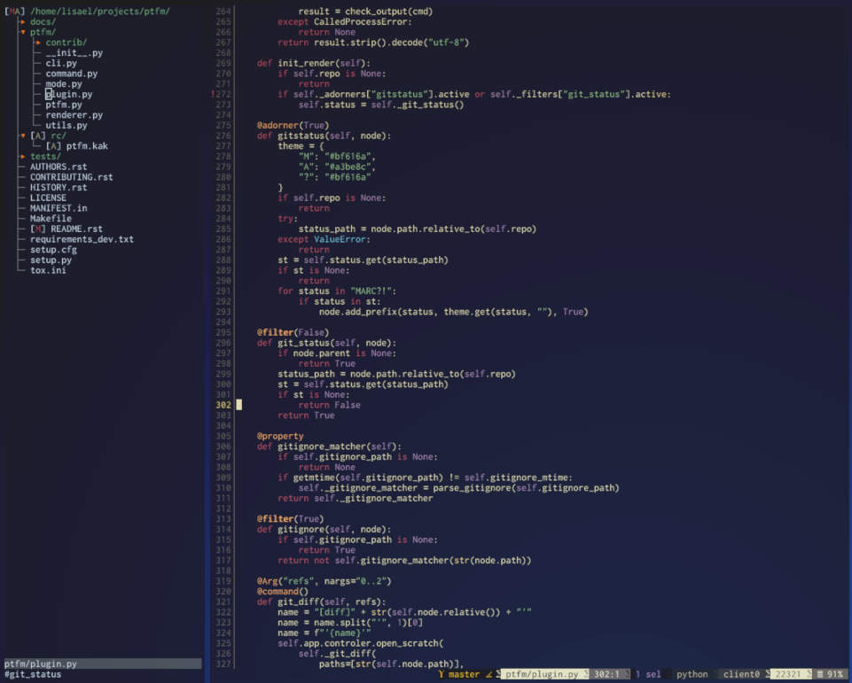

========
ptfm.kak
========

.. image:: https://gitlab.com/lisael/ptfm/badges/master/coverage.svg
        :target: https://gitlab.com/lisael/ptfm/commits/master

.. image:: https://gitlab.com/lisael/ptfm/badges/master/pipeline.svg
        :target: https://gitlab.com/lisael/ptfm/commits/master

.. image:: https://readthedocs.org/projects/ptfm/badge/?version=latest
        :target: https://ptfm.readthedocs.io/en/latest/?badge=latest
        :alt: Documentation Status

Promt-Toolkit file manager

Features
--------

* A standalone file manager
* Designed to communicate with an editor (only Kakoune is supported at the moment)
* Interacts with the window manager (sway and tmux are supported. I3 should be easy to add) 
* Binding are those of the editor

  * ``h``, ``j``, ``k``, ``l`` to navigate, (``l`` opens directory or edit files in the editor)
  * ``o`` to add a new file
  * ``dd`` or ``xd`` to delete a file (the deletion is not effective before you type ``:w``)
  * ``p`` to paste a previously ``dd`` eleted file
  * more to come (``i`` to edit a file name, ``xy`` to yank, ``X`` to select a bunch of file to apply a command to...)

* Commands, eg

  * ``:git_diff`` to show the diff of a file

* Togglable filters, eg

  * hide dotfiles
  * hide gitignored files
  * show only current git status

* Togglable adorners, eg

  * ``gitstatus`` to add visual hints on each file

* Plugable architecture: Commands, filters and adorners are defined in python plugins. It's
  planned to let the user deploy their own either manually or using ``plug.kak``

Planned Features
----------------

* Command history and completion
* Comprehensive help
* Color themes. It may even be feasible to automatically use the kakoune's colorsheme.
* More filters (From the top of my head: hide files marked as boring by the user)
* Merge request view
* More git related commands and binding (git add, git commit...)
* Support git submodules
* Abstract the git plugin in a CVS plugin that would support hg, svn and whatnot.
* At the moment, the tree is tied to the filesystem. Ptfm could display other kind of
  tree-like data (document structure, tag list...)
* Configurable key bindings

Install
-------

Requirements
++++++++++++

* python>=3.7
* virtualenv (optional, but you'll have to install ptfm globally or with ``pip install --user``)
* jq (only if your WM is sway or i3)

Using plug.kak
++++++++++++++

Add this in your ``kakrc``:

.. code-block:: kak
	
    plug "https://gitlab.com/lisael/ptfm" do %{
        ls .venv || virtualenv --python=/usr/bin/python3.7 .venv
        .venv/bin/pip install .
    } config %{
        # <F1> is a good choice because <F1> in ptfm goes back to the editor
        # ptfm-tmux is also available if you're in tmux
        map global normal <F1> :ptfm-sway<ret>
        map global insert <F1> "<a-;>:ptfm-sway<ret>"
    }

Credits
-------

This package was created with Cookiecutter_ and the `audreyr/cookiecutter-pypackage`_ project template.

.. _Cookiecutter: https://github.com/audreyr/cookiecutter
.. _`audreyr/cookiecutter-pypackage`: https://github.com/audreyr/cookiecutter-pypackage
